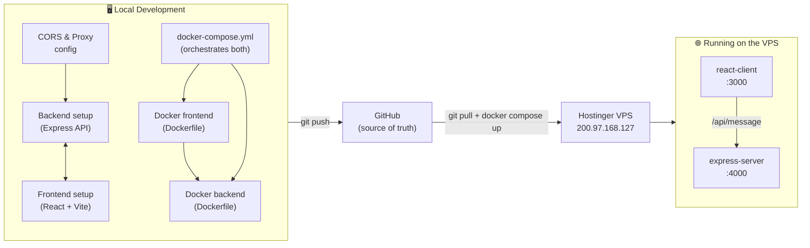

# Full-Stack App — Deployment Guide

A React (Vite) frontend + Express backend, containerized with Docker and
deployed to a Hostinger VPS. This guide explains the whole flow so **anyone**
can learn how it fits together and deploy it themselves.

---

## Architecture & Workflow



**The flow in words:**
1. Build the backend and frontend locally and wire them together (CORS + Vite proxy).
2. Containerize each with its own `Dockerfile`, and orchestrate both with `docker-compose.yml`.
3. Push to **GitHub**.
4. On the **Hostinger VPS**, pull the code and run `docker compose up` — the client (`:3000`) talks to the server (`:4000`).

---

## The key idea: no hard-coded IPs

The server IP used to be hard-coded in the code (`http://200.97.168.127:3000`).
That breaks the moment the IP changes or you add a domain.

Now **all environment-specific values live in one file: [`.env`](.env)** at the
project root. docker-compose reads it and injects the values into the containers.

```env
# .env  (project root)
SERVER_URL=http://200.97.168.127:4000   # where the frontend reaches the API
CLIENT_URL=http://200.97.168.127:3000   # origin the backend's CORS allows
```

To move to a new server or a real domain, **change only these two lines** — no
code edits.

### How the values travel

| Value        | Read by            | How it's used                                                        |
|--------------|--------------------|----------------------------------------------------------------------|
| `SERVER_URL` | `docker-compose.yml` | Passed as the `VITE_API_URL` **build arg** → baked into the frontend bundle so the browser knows where the API lives. |
| `CLIENT_URL` | `docker-compose.yml` | Passed as an **environment variable** to the server → added to the CORS allow-list at runtime. |

> **Why a build arg for the frontend?** Vite only exposes env vars at *build*
> time — the API URL is compiled into the static JS. The backend, by contrast,
> reads `CLIENT_URL` at *runtime*, so a plain environment variable is enough.

---

## How CORS works here

The Express server ([`server/index.js`](server/index.js)) builds its allow-list from:

- **Local dev defaults:** `localhost:5173`, `localhost:5174`, `localhost:3000`
- **Plus** whatever is in `CLIENT_URL` (comma-separated, so you can allow several origins)

Trailing slashes are stripped automatically, and requests with no `Origin`
header (curl, health checks) are allowed through. To allow multiple frontends:

```env
CLIENT_URL=http://200.97.168.127:3000,https://yourdomain.com
```

---

## Deploy to Hostinger (step by step)

Prerequisites on the VPS: **Docker** and the **Docker Compose plugin** installed,
and ports **3000** and **4000** open in the firewall.

```bash
# 1. SSH into the VPS
ssh root@200.97.168.127

# 2. Clone (first time) or pull the latest code
git clone <your-repo-url> app && cd app
#   ...on later deploys, just:
# cd app && git pull

# 3. Make sure .env has the correct public IP/domain
#    (copy the template the first time)
cp .env.example .env   # then edit .env if needed
cat .env

# 4. Build and start everything in the background
docker compose up -d --build

# 5. Check it's running
docker compose ps
docker compose logs -f server   # Ctrl+C to stop tailing
```

Now open:
- Frontend → `http://200.97.168.127:3000`
- API test → `http://200.97.168.127:4000/api/message`

### Updating after a code change

```bash
git pull
docker compose up -d --build   # rebuilds only what changed
```

### Useful commands

```bash
docker compose down            # stop and remove containers
docker compose restart server  # restart just the API
docker compose logs -f         # tail all logs
```

---

## Local development (without Docker)

```bash
# Terminal 1 — backend
cd server && npm install && npm start        # http://localhost:4000

# Terminal 2 — frontend
cd client && npm install && npm run dev       # http://localhost:5173
```

In dev, [`client/vite.config.js`](client/vite.config.js) proxies `/api` to
`localhost:4000`, and the localhost origins are already in the CORS allow-list.

---

## File reference

| File                         | Purpose                                                        |
|------------------------------|----------------------------------------------------------------|
| `.env`                       | The **one place** to set your server IP/domain. Holds only a public IP here (no secrets); if you ever add secrets, git-ignore it. |
| `.env.example`               | Template to copy into `.env`.                                  |
| `docker-compose.yml`         | Orchestrates the client + server containers and wires in env.  |
| `server/index.js`            | Express API + env-driven CORS.                                 |
| `server/Dockerfile`          | Builds the backend image.                                      |
| `client/Dockerfile`          | Multi-stage build → serves the static frontend on `:3000`.     |
| `client/.env`                | Local-dev-only API URL (overridden by docker-compose in prod). |
